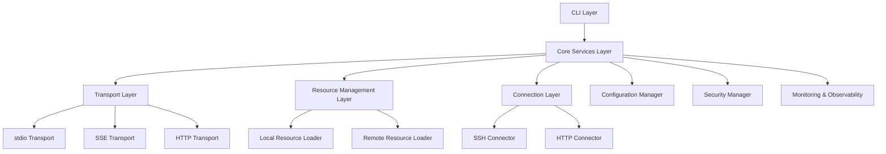

# Design Document

## Overview

The `mcpsc` (MCP Server Client) tool is designed as a modular, extensible CLI application that serves as a gateway middleware for the Model Context Protocol (MCP). The system implements a layered architecture with clear separation of concerns, supporting both server and client modes for MCP communication.

The core design philosophy emphasizes:
- **Modularity**: Pluggable components for transports, connectors, and resource loaders
- **Extensibility**: Interface-driven design enabling future protocol and connector additions
- **Observability**: Built-in monitoring, logging, and debugging capabilities
- **Security**: Comprehensive authentication, encryption, and access control
- **Performance**: Async/await patterns, connection pooling, and caching strategies

## Architecture

### High-Level Architecture



### Layered Architecture

#### 1. Presentation Layer (CLI)
- **Command Parser**: Built with oclif framework for robust CLI handling
- **Help System**: Auto-generated documentation and examples
- **Input Validation**: Parameter validation and user-friendly error messages
- **Output Formatting**: Support for human-readable and JSON output formats

#### 2. Application Layer (Core Services)
- **MCP Server Service**: Implements MCP protocol server functionality
- **MCP Client Service**: Implements MCP protocol client functionality
- **Resource Management Service**: Handles resource lifecycle and operations
- **Configuration Service**: Manages configuration loading, validation, and persistence
- **Security Service**: Handles authentication, authorization, and encryption

#### 3. Infrastructure Layer
- **Transport Adapters**: Protocol-specific communication handlers
- **Connection Managers**: Protocol-specific connection implementations
- **Resource Loaders**: Local and remote resource discovery and loading
- **Monitoring Collectors**: Metrics collection and health checking

## Components and Interfaces

### Core Interfaces

#### ITransport Interface
```typescript
interface ITransport {
  readonly name: string;
  readonly supportedMethods: string[];
  
  start(config: TransportConfig): Promise<void>;
  stop(): Promise<void>;
  send(message: MCPMessage): Promise<MCPResponse>;
  onMessage(handler: MessageHandler): void;
  getHealthStatus(): HealthStatus;
}
```

#### IConnector Interface
```typescript
interface IConnector {
  readonly type: string;
  readonly supportedProtocols: string[];
  readonly capabilities: ConnectorCapability[];
  
  connect(resource: Resource): Promise<Connection>;
  test(resource: Resource, options?: TestOptions): Promise<TestResult>;
  disconnect(connection: Connection): Promise<void>;
  execute(connection: Connection, command: Command): Promise<ExecutionResult>;
  getConnectionPool(): ConnectionPool;
  getSupportedCommands(): CommandDefinition[];
}

interface ConnectorCapability {
  name: string;
  description: string;
  parameters: ParameterDefinition[];
  security: SecurityRequirement[];
}

interface Command {
  type: string;
  parameters: Record<string, any>;
  timeout?: number;
  retryPolicy?: RetryPolicy;
  securityContext?: SecurityContext;
}

interface ExecutionResult {
  success: boolean;
  output?: any;
  error?: ExecutionError;
  metadata: ExecutionMetadata;
}
```

#### IResourceLoader Interface
```typescript
interface IResourceLoader {
  readonly source: string;
  readonly supportedTypes: ResourceType[];
  
  load(config: LoaderConfig): Promise<Resource[]>;
  validate(resource: Resource): ValidationResult;
  watch(callback: ResourceChangeCallback): void;
  refresh(): Promise<void>;
}
```

### Transport Layer Components

#### StdioTransport
- Implements stdio-based MCP communication for local process integration
- Handles JSON-RPC message serialization/deserialization
- Supports bidirectional communication through stdin/stdout

#### SSETransport
- Implements Server-Sent Events for web/IDE integration
- Provides HTTP endpoint for SSE connections
- Handles connection management and message broadcasting

#### StreamableHTTPTransport
- Implements long-lived HTTP connections for LLM agent integration
- Supports chunked transfer encoding for streaming responses
- Provides connection pooling and keep-alive management

### Resource Management Components

#### LocalResourceLoader
- Scans specified local directories for resource definitions
- Supports multiple file formats (JSON, YAML, JS, TS)
- Implements file watching for dynamic resource updates
- Provides resource validation and schema enforcement

#### RemoteResourceLoader
- Fetches resource definitions from remote URLs
- Supports multiple authentication methods (Basic Auth, API Key, Bearer Token)
- Implements caching with configurable TTL
- Handles network failures with retry mechanisms

#### ResourceRegistry
- Central registry for all loaded resources
- Provides resource lookup, filtering, and grouping
- Manages resource lifecycle (enable/disable, refresh)
- Implements resource dependency resolution

### Connection Layer Components

#### SSHConnector
- Uses ssh2 library for SSH connections
- Supports key-based and password authentication
- Implements jump host and port forwarding capabilities
- Reads and respects ~/.ssh/config settings
- Provides connection pooling and reuse

**Command Execution Capabilities:**
- **Shell Commands**: Execute arbitrary shell commands with output capture
- **File Operations**: Upload, download, and manipulate files
- **Port Forwarding**: Dynamic port forwarding and tunneling
- **SFTP Operations**: Secure file transfer operations
- **Interactive Sessions**: Support for interactive command sessions

**Security and Safety:**
- Command whitelisting and blacklisting
- Execution timeout and resource limits
- Privilege escalation controls
- Audit logging of all executed commands
- Sandboxing and isolation mechanisms

#### HTTPConnector
- Uses undici for high-performance HTTP connections
- Supports HTTP/1.1 and HTTP/2 protocols
- Implements custom TLS configuration and cipher suites
- Provides request/response interceptors for logging and monitoring
- Handles connection pooling and keep-alive

**API Execution Capabilities:**
- **REST Operations**: GET, POST, PUT, DELETE, PATCH requests
- **GraphQL Queries**: Support for GraphQL query and mutation execution
- **Webhook Handling**: Receive and process webhook notifications
- **File Upload/Download**: Multipart form data and binary transfers
- **Streaming Operations**: Server-sent events and streaming responses

**Security and Safety:**
- Rate limiting and throttling
- Request/response size limits
- Authentication token management
- SSL/TLS certificate validation
- Request sanitization and validation

## Data Models

### Core Data Models

#### Resource Model
```typescript
interface Resource {
  id: string;
  name: string;
  type: ResourceType;
  group?: string;
  enabled: boolean;
  metadata: ResourceMetadata;
  connection: ConnectionConfig;
  security: SecurityConfig;
  tags: string[];
  createdAt: Date;
  updatedAt: Date;
}

enum ResourceType {
  SSH_HOST = 'ssh-host',
  HTTP_API = 'http-api',
  DATABASE = 'database',
  KUBERNETES = 'kubernetes'
}
```

#### Configuration Model
```typescript
interface MCPSCConfig {
  server: ServerConfig;
  client: ClientConfig;
  resources: ResourcesConfig;
  security: SecurityConfig;
  monitoring: MonitoringConfig;
  logging: LoggingConfig;
}

interface ServerConfig {
  transports: TransportConfig[];
  host: string;
  port: number;
  tls?: TLSConfig;
  cors?: CORSConfig;
}
```

#### Connection Model
```typescript
interface Connection {
  id: string;
  resourceId: string;
  type: string;
  status: ConnectionStatus;
  metadata: ConnectionMetadata;
  createdAt: Date;
  lastUsed: Date;
}

enum ConnectionStatus {
  CONNECTING = 'connecting',
  CONNECTED = 'connected',
  DISCONNECTED = 'disconnected',
  ERROR = 'error'
}
```

### MCP Protocol Models

#### MCP Message Structure
```typescript
interface MCPMessage {
  jsonrpc: '2.0';
  id?: string | number;
  method: string;
  params?: any;
}

interface MCPResponse {
  jsonrpc: '2.0';
  id: string | number;
  result?: any;
  error?: MCPError;
}

interface MCPError {
  code: number;
  message: string;
  data?: any;
}
```

#### MCP Session Management
```typescript
interface MCPSession {
  id: string;
  clientId: string;
  transport: ITransport;
  state: SessionState;
  capabilities: SessionCapabilities;
  security: SessionSecurity;
  createdAt: Date;
  lastActivity: Date;
  metadata: SessionMetadata;
}

enum SessionState {
  INITIALIZING = 'initializing',
  ACTIVE = 'active',
  SUSPENDED = 'suspended',
  TERMINATED = 'terminated'
}

interface SessionCapabilities {
  supportedMethods: string[];
  maxConcurrentRequests: number;
  timeoutSettings: TimeoutConfig;
  resourceAccess: ResourceAccessConfig[];
}

interface SessionSecurity {
  authenticationMethod: string;
  permissions: Permission[];
  rateLimits: RateLimit[];
  auditSettings: AuditConfig;
}
```

### Session Management Components

#### SessionManager
- **Session Lifecycle**: Create, maintain, and terminate MCP sessions
- **State Management**: Track session state and handle state transitions
- **Capability Negotiation**: Negotiate supported features and methods
- **Security Enforcement**: Apply security policies and access controls
- **Resource Allocation**: Manage session-specific resource allocation

#### SessionSecurity
- **Authentication**: Verify client identity and credentials
- **Authorization**: Enforce permission-based access control
- **Rate Limiting**: Prevent abuse through request rate limiting
- **Audit Trail**: Comprehensive logging of session activities
- **Threat Detection**: Monitor for suspicious activities and patterns

## Error Handling

### Error Classification System

#### Error Categories
1. **Configuration Errors** (1000-1099)
   - Invalid configuration format
   - Missing required parameters
   - Schema validation failures

2. **Connection Errors** (2000-2099)
   - Network connectivity issues
   - Authentication failures
   - Protocol negotiation failures

3. **Resource Errors** (3000-3099)
   - Resource not found
   - Invalid resource definition
   - Resource loading failures

4. **Protocol Errors** (4000-4099)
   - MCP protocol violations
   - Unsupported methods
   - Message format errors

5. **System Errors** (5000-5099)
   - Internal system failures
   - Resource exhaustion
   - Unexpected exceptions

6. **Execution Errors** (6000-6099)
   - Command execution failures
   - Security policy violations
   - Resource limit exceeded
   - Timeout errors

#### Error Handling Strategy

```typescript
class MCPSCError extends Error {
  constructor(
    public readonly code: number,
    message: string,
    public readonly context?: any,
    public readonly suggestions?: string[]
  ) {
    super(message);
  }
}

interface ErrorHandler {
  handle(error: Error): ErrorResponse;
  canHandle(error: Error): boolean;
}
```

### Recovery Mechanisms

- **Circuit Breaker Pattern**: Prevents cascading failures for external service calls
- **Retry Logic**: Configurable retry strategies with exponential backoff
- **Graceful Degradation**: Fallback mechanisms when services are unavailable
- **Health Checks**: Proactive monitoring and automatic recovery

## Testing Strategy

### Testing Pyramid

#### Unit Tests (70%)
- Individual component testing with mocks
- Interface contract testing
- Configuration validation testing
- Error handling scenarios

#### Integration Tests (20%)
- Transport layer integration
- Resource loading and management
- Connection establishment and management
- End-to-end MCP protocol communication

#### End-to-End Tests (10%)
- Full CLI workflow testing
- Multi-transport scenarios
- Real resource connection testing
- Performance and load testing

### Test Infrastructure

#### Mock Implementations
- MockTransport for transport layer testing
- MockConnector for connection testing
- MockResourceLoader for resource management testing
- Test fixtures for various resource types

#### Test Utilities
- Configuration builders for test scenarios
- Resource factories for test data generation
- Connection simulators for network testing
- Performance measurement utilities

### Continuous Testing

- **Pre-commit Hooks**: Run unit tests and linting
- **CI Pipeline**: Full test suite execution on multiple Node.js versions
- **Integration Testing**: Automated testing against real MCP servers
- **Performance Regression**: Automated performance benchmarking

## Security Architecture

### Authentication and Authorization

#### Multi-layered Security
1. **Transport Security**: TLS encryption for all network communications
2. **Session Security**: MCP session-level authentication and authorization
3. **Resource Security**: Per-resource authentication and authorization
4. **Command Security**: Execution-level security and sandboxing
5. **API Security**: MCP protocol-level security and validation
6. **Configuration Security**: Encrypted storage of sensitive configuration data

#### Authentication Methods
- **SSH Key Authentication**: Support for RSA, ECDSA, and Ed25519 keys
- **HTTP Authentication**: Basic Auth, Bearer Token, API Key (header/query)
- **Certificate Authentication**: Client certificate validation for mutual TLS
- **Environment-based**: Secure injection of credentials via environment variables
- **MCP Session Authentication**: Session-based authentication for MCP clients

### Command Execution Security

#### Security Policies
```typescript
interface ExecutionPolicy {
  allowedCommands: CommandPattern[];
  deniedCommands: CommandPattern[];
  resourceLimits: ResourceLimits;
  timeoutLimits: TimeoutLimits;
  auditRequirements: AuditRequirement[];
}

interface CommandPattern {
  connector: string;
  command: string;
  parameters?: ParameterConstraint[];
  conditions?: SecurityCondition[];
}

interface ResourceLimits {
  maxMemory: number;
  maxCpu: number;
  maxDiskSpace: number;
  maxNetworkBandwidth: number;
  maxExecutionTime: number;
}
```

#### Sandboxing and Isolation
- **Process Isolation**: Execute commands in isolated processes
- **Resource Constraints**: Limit CPU, memory, and I/O usage
- **Network Isolation**: Control network access for executed commands
- **File System Isolation**: Restrict file system access and modifications
- **Privilege Dropping**: Execute with minimal required privileges

#### Fault Tolerance and Recovery
- **Circuit Breaker**: Prevent cascading failures from command execution
- **Retry Logic**: Intelligent retry mechanisms with exponential backoff
- **Graceful Degradation**: Fallback mechanisms when commands fail
- **Error Isolation**: Prevent command failures from affecting other operations
- **Recovery Procedures**: Automated recovery from common failure scenarios

### Security Configuration

```typescript
interface SecurityConfig {
  tls: {
    minVersion: string;
    cipherSuites: string[];
    certificateValidation: boolean;
    customCA?: string;
  };
  authentication: {
    methods: AuthMethod[];
    timeout: number;
    maxRetries: number;
  };
  encryption: {
    algorithm: string;
    keyDerivation: string;
    saltLength: number;
  };
}
```

### Security Best Practices

- **Principle of Least Privilege**: Minimal required permissions for each operation
- **Defense in Depth**: Multiple security layers and validation points
- **Secure Defaults**: Security-first default configurations
- **Audit Logging**: Comprehensive security event logging
- **Secret Management**: Secure handling and storage of sensitive data

## Performance and Scalability

### Performance Optimization

#### Connection Management
- **Connection Pooling**: Reuse connections to reduce overhead
- **Keep-Alive**: Maintain persistent connections where appropriate
- **Load Balancing**: Distribute connections across multiple endpoints
- **Circuit Breaking**: Prevent resource exhaustion from failed services

#### Caching Strategy
- **Resource Metadata Caching**: Cache resource definitions with TTL
- **Connection State Caching**: Cache connection status and metadata
- **Configuration Caching**: Cache parsed configuration for performance
- **DNS Caching**: Cache DNS resolutions to reduce lookup time

#### Async/Await Patterns
- **Non-blocking I/O**: All network operations use async patterns
- **Concurrent Processing**: Parallel resource loading and connection establishment
- **Stream Processing**: Efficient handling of large data transfers
- **Memory Management**: Proper cleanup and garbage collection

### Scalability Design

#### Horizontal Scaling
- **Stateless Design**: No server-side state for easy scaling
- **External Configuration**: Configuration stored externally for multi-instance deployment
- **Load Distribution**: Support for multiple mcpsc instances behind load balancers
- **Service Discovery**: Dynamic discovery of available resources and services

#### Resource Management
- **Memory Optimization**: Efficient memory usage for large resource sets
- **CPU Optimization**: Optimized algorithms for resource lookup and filtering
- **Network Optimization**: Efficient protocol usage and message batching
- **Storage Optimization**: Efficient configuration and cache storage

## Monitoring and Observability

### Metrics Collection

#### Prometheus Metrics
```typescript
interface MCPSCMetrics {
  // Connection metrics
  activeConnections: Gauge;
  connectionDuration: Histogram;
  connectionErrors: Counter;
  
  // Request metrics
  requestDuration: Histogram;
  requestCount: Counter;
  requestErrors: Counter;
  
  // Resource metrics
  resourceLoadTime: Histogram;
  resourceCount: Gauge;
  resourceErrors: Counter;
  
  // System metrics
  memoryUsage: Gauge;
  cpuUsage: Gauge;
  gcDuration: Histogram;
}
```

#### Health Checks
- **Liveness Probe**: Basic application health status
- **Readiness Probe**: Service readiness for traffic
- **Dependency Checks**: External service availability
- **Resource Validation**: Resource configuration health

### Logging Strategy

#### Structured Logging
```typescript
interface LogEntry {
  timestamp: string;
  level: LogLevel;
  message: string;
  traceId: string;
  component: string;
  metadata: Record<string, any>;
}
```

#### Log Levels and Context
- **TRACE**: Detailed execution flow for debugging
- **DEBUG**: Development and troubleshooting information
- **INFO**: General operational information
- **WARN**: Warning conditions that should be addressed
- **ERROR**: Error conditions requiring attention

#### Correlation and Tracing
- **Request Tracing**: Unique trace IDs for request correlation
- **Component Tracing**: Component-level execution tracking
- **Performance Tracing**: Execution time and resource usage tracking
- **Error Correlation**: Link errors to specific requests and operations

### Debugging and Troubleshooting

#### Debug Modes
- **Verbose Mode**: Enhanced logging with detailed information
- **Debug Mode**: Development-focused debugging information
- **Trace Mode**: Comprehensive execution tracing
- **Performance Mode**: Performance profiling and analysis

#### Diagnostic Tools
- **Connection Testing**: Built-in connection diagnostic tools
- **Configuration Validation**: Comprehensive configuration checking
- **Resource Inspection**: Resource definition and status inspection
- **Protocol Analysis**: MCP message inspection and validation